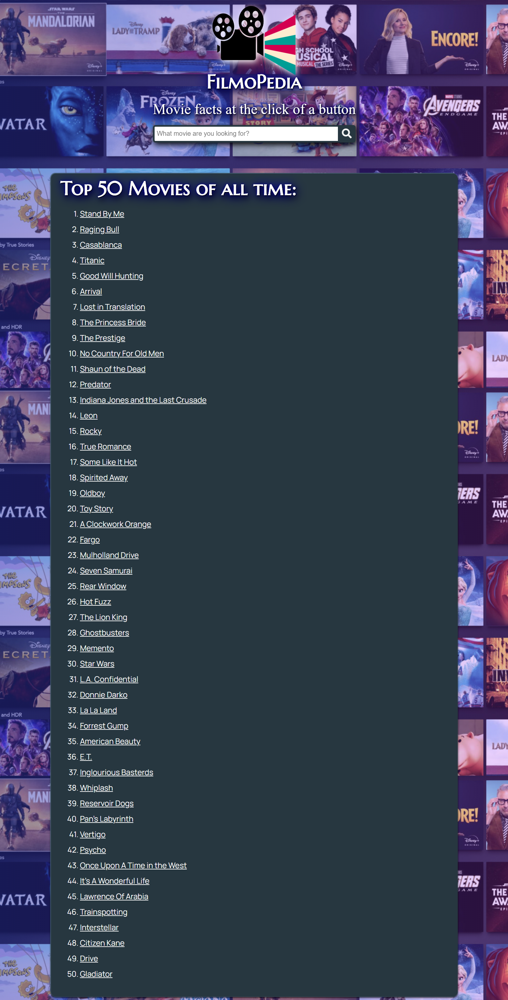
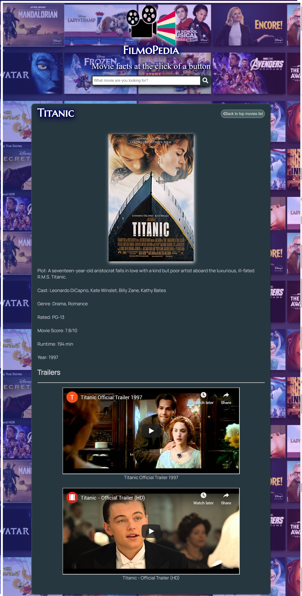
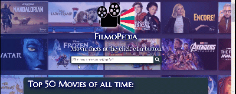

Application name: FilmoPedia

Link to my Live app: https://renniesb.github.io/filmopedia/

# Screenshots

# Summary

This app allows users to search for information about movies they are interested in. The first screen the user sees is the search bar and the 50 greatest movies list. From this page the user can click on one of the 50 greatest movies to get a description of that movie. This description includes the movie name, the movie poster, the plot of the movie, its rating, it's value score, the cast in the movie, the year it came out as well as trailers for the movie. The user can go back to the top 50 movies list from the movie info screen by selecting the "back to top movies list" button. At the top of the page when the user enters in a movie name and presses the search button key the information on the movie they searched is displayed below the search bar. 

# Technologies Used
HTML5, CSS3, JavaScript and jQuery.
